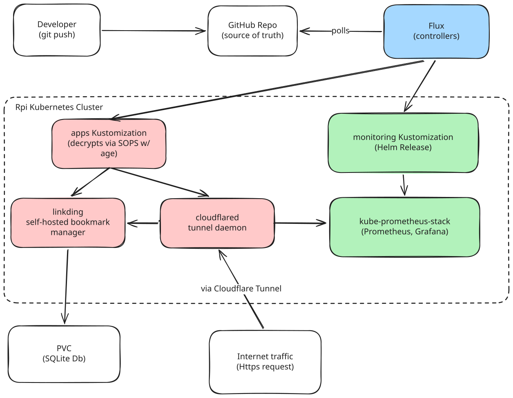

# RPI Homelab

A GitOps-managed homelab Kubernetes cluster (Raspberry Pi) that uses FluxCD to sync deployments from this repo, SOPS/age for secret encryption, and Cloudflare Tunnel for ingress. Currently runs a self-hosted linkding bookmark manager and a kube-prometheus-stack observability stack.

## Architecture



## Tech Stack

- **GitOps**: FluxCD (GitRepository + Kustomization controllers)
- **Compute**: Raspberry Pi Kubernetes cluster
- **Config management**: Kustomize (base/overlay pattern)
- **Package management**: Helm (via Flux `HelmRelease`/`HelmRepository`)
- **Secrets**: SOPS encryption with age
- **Ingress**: Cloudflare Tunnel (`cloudflared`)
- **Monitoring**: kube-prometheus-stack (Prometheus, Grafana, Alertmanager)
- **Apps**: linkding (self-hosted bookmark manager)

## Prerequisites

- A Kubernetes cluster with `kubectl` access
- [Flux CLI](https://fluxcd.io/flux/installation/) bootstrapped against this repo
- [SOPS](https://github.com/getsops/sops) and [age](https://github.com/FiloSottile/age) installed, with the cluster's age private key available for decryption
- A Cloudflare account and tunnel credentials for ingress
- SSH access configured for `git@github.com` (Flux syncs over SSH)

## Directory Structure
[FluxCD's Monorepo Structure](https://fluxcd.io/flux/guides/repository-structure/)
```
rpi-cluster/
├── clusters/
│   └── staging/
│       ├── flux-system/         # Flux-managed bootstrap manifests (gotk-components, gotk-sync)
│       ├── apps.yaml             # Kustomization: syncs apps/staging, SOPS decryption enabled
│       ├── monitoring.yaml       # Kustomization: syncs monitoring/controllers/staging
│       └── .sops.yaml            # SOPS encryption rules (age recipient, encrypted_regex)
├── apps/
│   ├── base/
│   │   └── linkding/             # namespace, deployment, service, PVC
│   └── staging/
│       └── linkding/             # base overlay + cloudflared tunnel + encrypted secrets
├── monitoring/
│   └── controllers/
│       ├── base/
│       │   └── kube-prometheus-stack/   # namespace, HelmRepository, HelmRelease
│       └── staging/
│           └── kube-prometheus-stack/   # overlay referencing base
└── README.md
```
